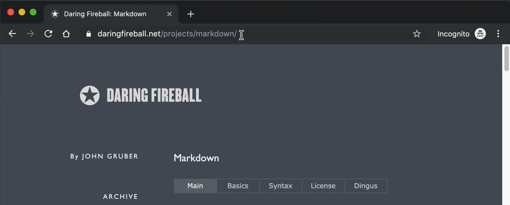

# decolink

Decoration link to markdown

## Install

- Alfred Workflow
  - Download `decolink.alfredworkflow` from [github release page](https://github.com/seapy/decolink/releases) and double click.
- CLI
  - Download proper file(if macOS `decolink_darwin_amd64.gz`) from [github release page](https://github.com/seapy/decolink/releases) and ungzip & run.

## Usage

### Alfred Workflow




### CLI

```
$ decolink https://daringfireball.net/projects/markdown/

[Daring Fireball: Markdown](https://daringfireball.net/projects/markdown/)
```

## See also

* [copy-url-for-alfred](https://github.com/fallroot/copy-url-for-alfred)
